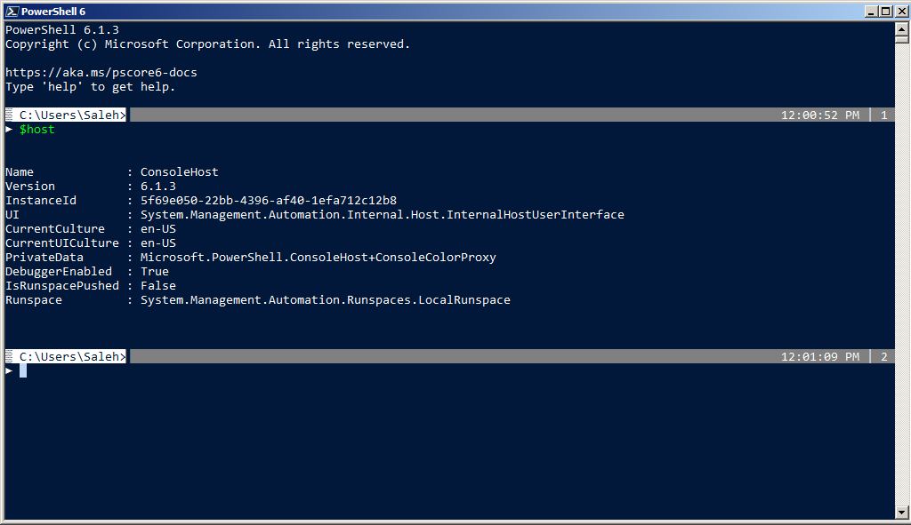
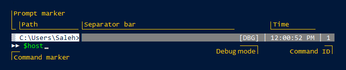

# GoodPrompt
A good prompt for PowerShell.

## Description
A prompt with _marker_, _path_, _separator bar_, _time_, _command id_ and _command marker_ for :heart: [Microsoft PowerShell](https://microsoft.com/powershell) :heart:.

## Screenshots
Interface:  


Structure:  


## Details
- **Prompt marker**: Indicating begin of a new prompt.
- **Path**: Current path and address.
- **Time**: Time of start of current prompt, indeed, execution time of last command.
- **Command ID**: ID for new command (You can use this ID to refer to the command later or use it in TAB completion).
- **Separator bar**: A bar for separating new command from previous command.
- **Command marker**: Indicating begin of new command and displaying cursor, it also displays nested prompts by repeated marker.
- **Debug mode**: Indicating whether is in debugging mode or not.

## Installation
Simply, put content of `GoodPrompt.ps1` to your PowerShell's profile and reopen PowerShell.

To create a profile, execute [Create-Profile.ps1](https://gist.github.com/saleh-rahimzadeh/c8833ade49e10513ad9ac3df275aecdb) gist.  

See `about_Prompts` help topic for more information:
```powershell
PS> get-help about_Prompts
```

## Command ID
You can use **Command ID** and TAB completion to recall and select a command from history.  
Simply, type Command ID precede '#' sign and press \<TAB\> key:
```
PS> #<command_id><TAB>
```
Example:
```powershell
PS> #9<TAB>
```

You can also see history of commands and their IDs by one of following cmdlets:
```powershell
PS> h
PS> history
PS> Get-History
```

## Dependencies
Requirment is [PowerShell Core 6](https://github.com/powershell/powershell) and above.  

To run on PowerShell 5 and below, replace `` `u{####} `` codes with `$([char]0x####)`.

Example: `` "`u{2592}" `` replace to `"$([char]0x2592)"`.

## Contributing
Everyone can contribute to this project, improving the code or adding functions. 

## License
GoodPrompt is licensed under the MIT license.
